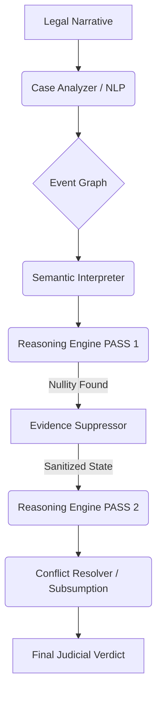

<p align="center">
  
</p>

<h1 align="center">Counselor AI (Digital Judge)</h1>

<p align="center">
  <strong>An Advanced Graphical Judicial Reasoning Engine for Surgical Evidence Suppression.</strong>
</p>

<p align="center">
  
  
  
  
</p>

---

## 🚀 About the Project

**Counselor AI** is a state-of-the-art legal inference engine designed to model complex judicial logic with "Surgical Precision." Unlike binary rule-matchers, it utilizes a **Graphical Evidence Provenance** system to handle procedural nullities (Article 30 CPP) without collapsing an entire legal case.

It is specifically engineered to handle the nuances of the Egyptian Criminal Procedure Code, accurately differentiating between "Fruits of the Poisonous Tree" and "Independent Legal Sources."

---

## 🧠 Features

- **💉 Surgical Evidence Suppression**: Automatically invalidates specific evidence items linked to illegal procedures while preserving independent testimony.
- **⚖️ Legal Subsumption**: Implements the "Greater Crime Absorbs Lesser" principle to produce clean, singular judicial outcomes.
- **🔍 2-Pass Reasoning Loop**: Pass 1 identifies procedural flaws; Pass 2 re-evaluates the sanitized case state for final judgment.
- **👤 Entity Disambiguation**: Advanced NLP filters to eliminate "Phantom Actors" and focus reasoning purely on legal defendants.
- **📈 Provenance Graphing**: Tracks the origin of every evidence item to guarantee a bulletproof reasoning trace.

---

## 🏗 Architecture

The engine is built on a modular "Reasoning Pipeline" that separates interpretation, conflict resolution, and evidence evaluation.



---

## ⚙️ Tech Stack

- **Core Engine**: Python 3.10+
- **Database**: PostgreSQL (Structured Legal Graph)
- **NLP Layer**: Custom Rule-based Entity Recognition & Stop-word Filtering
- **Logic System**: Multi-priority Conflict Resolution Engine
- **Inference**: Recursive Two-Pass Feedback Loop

---

## 📦 Installation

```bash
# Clone the repository
git clone https://github.com/Mahmoud997s/-counsellor-AI.git
cd -counsellor-AI

# Install dependencies (ensure venv is active)
# pip install -r requirements.txt

# Initializing the v7.2 database
python database/migrate_v7.py
python database/seed_golden_rules.py
```

---

## ▶️ Usage

To run the judicial engine against a complex case scenario:

```python
from case_manager import CaseManager

manager = CaseManager()
# High-level API for v7.2 inference
case_id = "your-case-uuid"
state = manager.recompute_case_state(case_id)
verdict = manager.engine.run(case_id, state)

print(f"Final Outcome: {verdict['defendants']['المتهم']['final_verdict']['verdict']}")
```

---

## 📡 API Example Output

```json
{
  "defendant": "المتهم",
  "primary_verdict": "الإعدام أو السجن المؤبد",
  "law_reference": "قانون العقوبات المصري (المادة 230-234)",
  "procedural_notes": [
    {
      "article": "30 أ.ج",
      "verdict": "بطلان التفتيش وما تلاه من دليل"
    }
  ],
  "suppressed_evidence": ["weapon_found"],
  "status": "CONVICTION_BASED_ON_INDEPENDENT_EVIDENCE"
}
```

---

## 🧪 Testing

Counselor AI includes a robust test suite for validating surgical suppression logic.

```bash
# Run the Surgical Strike v7.2 Test
python test_digital_judge_v7_surgical_strike.py
```

---

## 🤝 Contributing

We welcome senior legal engineering contributions!
1. Fork the Project
2. Create your Feature Branch (`git checkout -b feature/AmazingFeature`)
3. Commit your Changes (`git commit -m 'Add some AmazingFeature'`)
4. Push to the Branch (`git push origin feature/AmazingFeature`)
5. Open a Pull Request

---

## 📜 License

Distributed under the MIT License. See `LICENSE` for more information.

<p align="right">(<a href="#top">back to top</a>)</p>
