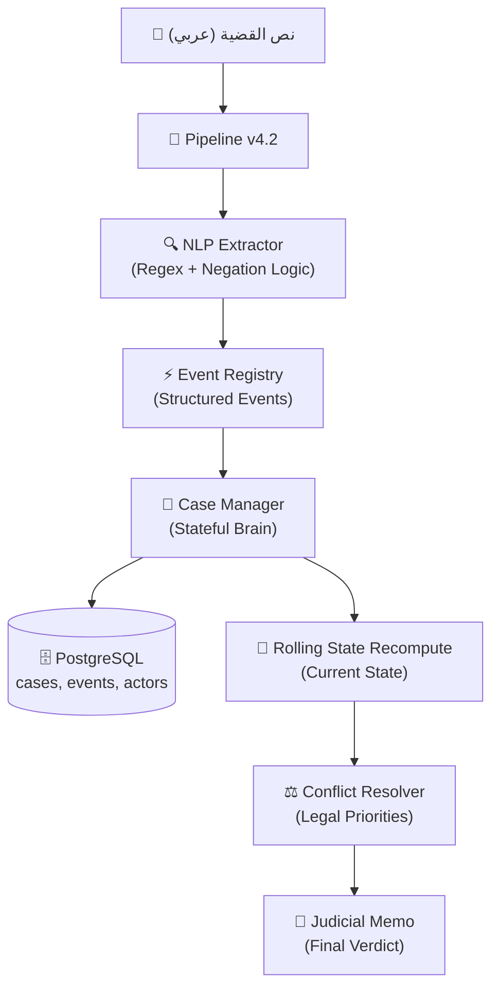
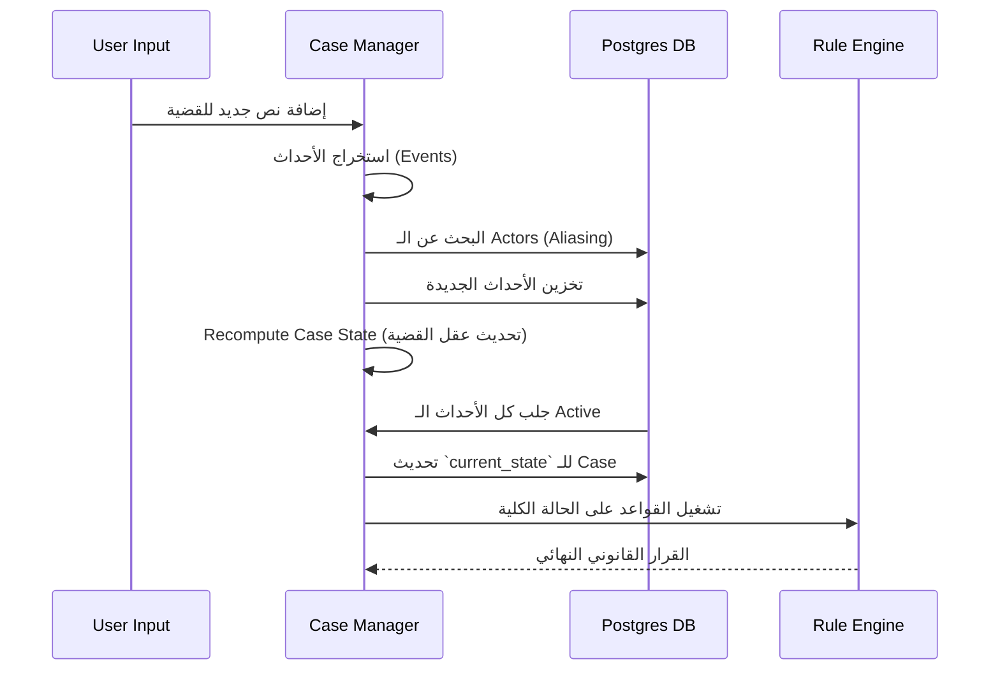

# ⚖️ Counselor AI: الدليل الفني الشامل (A to Z)
**النظام المتطور للاستدلال القانوني المصري (v4.2)**

---

## 🏛️ 1. الرؤية والفلسفة (The Concept)
Counselor AI ليس مجرد "شات بوت"؛ هو **محرك استدلال (Inference Engine)** مصمم لفهم نصوص القانون المصري وتطبيقها على الوقائع بدقة منطقية.

### الفلسفة الأساسية:
- **تحويل النص إلى منطق**: تحويل مواد القانون الجامدة إلى "قواعد برمجية" (Logic Rules).
- **الاستقلال التام**: يعمل النظام بالكامل Offline (بدون الحاجة لإنترنت أو APIs خارجية) لضمان الخصوصية القانونية.
- **الفهم الزمني**: القدرة على فهم تطور القضية عبر الزمن وليس مجرد لقطة واحدة.

---

## 🏗️ 2. المعمارية الكلية (Architecture Diagram)

---

## 🗄️ 3. طبقة البيانات (Persistence Layer)
يعتمد النظام على **PostgreSQL** كنواة لتخزين المعرفة والقواعد والوقائع.

### أ. المعرفة القانونية (Knowledge Bases):
- **`articles`**: نصوص القانون المصري الأصلية (مدني، جنائي، إجراءات).
- **`rules`**: القواعد المستخرجة (إذا حدث [أ] و [ب] -> الحكم [ج]).
- **`concepts`**: الروابط بين الكلمات القانونية (مثل: قتل = إزهاق روح).

### ب. ذاكرة القضية (The Brain Tables):
- **`cases`**: يحمل الـ `current_state` (الحالة الحالية للقضية).
- **`actors`**: يتذكر المتهمين والمجني عليهم وأسماءهم المستعارة (Aliases).
- **`events`**: سجل تاريخي لكل "حدث" تم استخراجه.
- **`contradictions`**: سجل للتناقضات المكتشفة بين الأدلة.

---

## 🔍 4. كيف يقرأ النظام (NLP Engine)
تتم عملية "الفهم" عبر عدة مراحل:

### 1️⃣ التنظيف (Normalizing):
يتم توحيد الحروف (أ، إ، آ -> ا) وإزالة المسافات الطويلة والتشكيل لضمان جودة الـ matching.

### 2️⃣ منطق النفي (Negation Logic):
يفهم النظام أن:
- **"قتله عمداً"** -> `intent: True`
- **"لم يقتله عمداً"** -> `intent: False`

### 3️⃣ استخراج الـ Actors:
يتم ربط الضمائر (أحمد ضربه -> هو -> أحمد) من خلال نظام الـ Aliases في طبقة الـ `CaseManager`.

---

## 🧠 5. العقل النشط (Stateful Brain v4.2)
هذا هو قلب Counselor AI؛ حيث يتم بناء "فهم تراكمي".

---

## ⚖️ 6. محرك حل التعارضات (Conflict Resolver)
عندما تتعارض الأدلة، يطبق النظام "الأولويات القانونية":

1. **Procedural Rules (أعلى أولوية)**: مثل "بطلان التفتيش"؛ إذا كان التفتيش باطلاً، فكل دليل نتج عنه هو باطل قانوناً.
2. **Override Rules**: مثل "الدفاع الشرعي"؛ يُسقط تهمة القتل رغم ثبوت الفعل.
3. **Substantive Rules**: العقوبات العادية (سجن، إعدام).

> [!IMPORTANT]
> النظام يطبق "قاعدة الأصل في الإنسان البراءة" عند تساوي الأدلة المتعارضة، أو يطلب تدخلاً بشرياً لتوضيح التناقض.

---

## 🪟 7. معالجة المستندات الضخمة (Sliding Windows)
بدلاً من قراءة 100 صفحة دفعة واحدة وفقدان الذاكرة (Memory Saturation)، يستخدم النظام **Sliding Windows with Overlap**:
- يقرأ 1200 كلمة.
- يحتفظ بـ 400 كلمة للتداخل (Overlap) لضمان عدم ضياع جملة في منتصف النافذة.
- "العقل" (Postgres) هو من يجمع المعلومات بين هذه النوافذ.

---

## 📜 8. المذكرة القانونية (Judicial Memo Rendering)
النظام لا يعطيك مجرد `{"verdict": "jail"}`، بل يصيغ مخرجاته في قوالب قضائية رصينة:

**مثال:**
> "وحيث إن التفتيش قد وقع باطلاً لعدم استناد مأمور الضبط القضائي لإذن نيابة، فإنه يبطل ما تلاه من إجراءات..."

---

## 🧪 9. كيف نضمن الدقة؟ (Verification)
نستخدم **Golden Rules Test Suite**:
- لدينا 16+ حالة اختبار "ذهبية" (مضمونة الحكم).
- يتم تشغيلها آلياً بعد كل تعديل في الكود لضمان عدم حدوث Regression (تراجع في الأداء).

---

## 🚀 10. خارطة الطريق (Roadmap)
1. **Vector Memory**: إضافة محرك بحث متجهات (pgvector) للتحليل الدلالي للأدلة.
2. **LLM Hybrid**: دمج نماذج LLM محلية لتلخيص المستندات الطويلة.
3. **Advanced NER**: تعلم آلي لاستخراج الكيانات القانونية بشكل أكثر ذكاءً.

---

> [!TIP]
> **مفتاح النجاح**: نظام Counselor AI لا يخزن نصوصاً فقط، بل يخزن **"حالة قانونية متغيرة"**. كل كلمة جديدة تضيف معلومة، والنظام يعيد بناء فهمه للقضية (Recompute) لحظياً.
