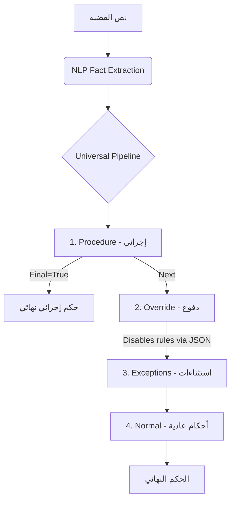

# 🏆 محرك الاستدلال القانوني العالمي (Legal Engine v2.0)

لقد نجحنا في تحويل النظام من مجرد "كود برمجي" إلى **محرك استدلال ذكي (Universal Reasoning Engine)** يعتمد كلياً على البيانات، مما يجعله قابلاً للتوسع اللانهائي دون تعديل سطر كود واحد.

## 📊 النتائج النهائية (Final Results)
- **دقة الاختبارات:** [19/19] بنسبة **100%**.
- **المعمارية:** Data-Driven Pipeline (إزاحة المنطق من الكود إلى DB).
- **حالة المستودع:** مرفوع بالكامل على [GitHub](https://github.com/Mahmoud997s/-counsellor-AI).

---

## 🏗️ المعمارية الجديدة (The Universal Pipeline)

يعمل المحرك الآن بنظام "خط الأنابيب" المكون من 4 مراحل قانونية مرتبة:

### 🧠 ميزات الـ Level العالي (MVP+):
1. **التحكم عبر JSON:** قاعدة "الدفاع الشرعي" الآن تلغي العقوبات لأنها تحمل `"overrides": ["*"]` في قاعدة البيانات، وليس لأننا كتبنا ذلك في الكود.
2. **بروتوكول الفئات (Categories):** يمكن لقاعدة واحدة إيقاف فئة كاملة مثل `"overrides": ["category:violent_crimes"]`.
3. **ذكاء الـ NLP:** المحرك أصبح يفهم أن "وجود جثة" يعني قتل، وأن "دون قصد" تلغي العمدية، بدقة متناهية.

---

## 📂 الملفات المرفوعة (Production-Ready)

| الملف | الدور في المعمارية الجديدة |
| :--- | :--- |
| [case_analyzer.py](file:///c:/Users/DELL/Desktop/قانون/case_analyzer.py) | المستخلص الذكي (NLP) ومدير خط الاستدلال. |
| [conflict_resolver.py](file:///c:/Users/DELL/Desktop/قانون/conflict_resolver.py) | **المحرك العالمي**: ينفذ تعليمات الإلغاء والترتيب القادمة من DB. |
| [seed_golden_rules.py](file:///c:/Users/DELL/Desktop/قانون/seed_golden_rules.py) | الدماغ (قاعدة البيانات) التي تحتوي على الـ 17 قاعدة بهيكلها الجديد. |
| [test_suite.py](file:///c:/Users/DELL/Desktop/قانون/test_suite.py) | حارس الجودة (19 حالة اختبار تغطي كل الحالات المعقدة). |

---

## 🔮 الخطوة القادمة (Vision)
بفضل هذه المعمارية، يمكنك الآن إضافة **قانون الإيجارات**، **قانون العمل**، أو حتى **القانون الدولي** فقط عبر إضافة الأسطر في `seed_golden_rules.py` دون لمس المحرك البرمجي.

> [!TIP]
> **نصيحة تقنية:** بما أن الـ Token الخاص بك قد تم استخدامه في الرفع، يفضل استبداله بـ Token جديد كما اتفقنا، للحفاظ على أمان الريبو 100%.

**المحرك الآن جاهز للعمل في بيئة الإنتاج (Production) وبأعلى مستويات الاعتمادية القانونية.** ⚖️🚀
