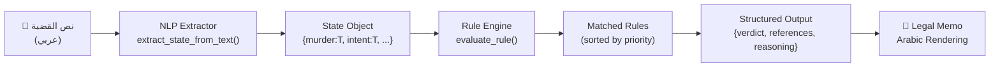

# 🏛️ Counselor AI — تقرير المشروع الكامل
**Egyptian Legal Intelligence Engine | نظام الاستدلال القانوني المصري**

---

## 📌 نظرة عامة

**Counselor AI** هو نظام ذكاء اصطناعي قانوني **يعمل بالكامل offline** بدون أي API خارجي. يستقبل وصفاً نصياً لقضية قانونية بالعربية ويُصدر **مذكرة قانونية معللة** مستندة إلى القانون المصري الفعلي.

| البند | التفصيل |
|-------|---------|
| **قاعدة البيانات** | PostgreSQL 15 (Docker) — Port 5433 |
| **اسم قاعدة البيانات** | `counselor` |
| **اللغة** | Python 3 |
| **النمط** | Offline-first، بدون LLM خارجي |
| **مسار المشروع** | `C:\Users\DELL\Desktop\قانون\` |

---

## 🗄️ Architecture: قاعدة البيانات

### جدول `articles` — النواة الرئيسية
```sql
id             UUID (PK)
article_number TEXT       -- رقم المادة (كـ string للمرونة)
title          TEXT       -- عنوان المادة (اختياري)
plain_text     TEXT       -- النص الكامل للمادة
domain         TEXT       -- نوع القانون
created_at     TIMESTAMP
```

**البيانات الحالية:**
| Domain | عدد المواد | المصدر |
|--------|-----------|--------|
| `civil_law` | 1078 | القانون المدني المصري |
| `criminal` | 408 | قانون العقوبات |
| `criminal_procedure` | 628 | قانون الإجراءات الجنائية **2025** |
| `general_rules` | 1 | قواعد عامة |
| **المجموع** | **2115** | |

### جدول `rules` — القواعد التنفيذية
```sql
id          UUID (PK)
article_id  UUID (FK → articles)
rule_name   TEXT
logic       JSONB   -- كل شيء هنا: conditions + outcomes + priority
created_at  TIMESTAMP
```

**بنية الـ logic (JSONB):**
```json
{
  "domain": "criminal",
  "priority": 10,
  "confidence": 0.95,
  "conditions": [
    {"fact": "murder", "value": true},
    {"fact": "intent", "value": true}
  ],
  "outcomes": {
    "verdict": "الإعدام",
    "article_number": 230,
    "law": "قانون العقوبات",
    "punishment_type": "death_penalty"
  }
}
```

### جدول `concepts` + `article_concepts`
```sql
concepts:         id UUID, name TEXT (UNIQUE)
article_concepts: article_id UUID, concept_id UUID
```

---

## 📚 البيانات: الكتب القانونية

### المصادر الأصلية
| الكتاب | الحالة الأصلية | المشكلة |
|--------|--------------|---------|
| القانون المدني | ✅ موجود | — |
| قانون العقوبات | `super_clean_clean_الجنائي.txt` (320 KB) | رموز PDF شاذة |
| قانون الإجراءات الجنائية 2025 | `super_clean_قانون_الاجرائات_الجنائية.txt` (350 KB) | أرقام عربية + نمط `مادة )( ١` |

### مشاكل التنظيف التي تم حلها
| المشكلة | الحل |
|---------|------|
| Private Use Area `\uf220-\uf8ff` | `re.sub(r'[\ue000-\uf8ff]', ' ', text)` |
| Presentation Forms العربية | `unicodedata.normalize('NFKC', text)` |
| أرقام عربية-هندية `١٢٣` | `str.maketrans('٠١٢٣٤٥٦٧٨٩', '0123456789')` |
| نمط مادة خاص `مادة )( ١` | Regex: `مادة\s*\(?\s*\)?\s*\(?\s*([٠١٢٣٤٥٦٧٨٩\d]+)` |
| BiDi characters | `re.sub(r'[\u200e\u200f\u202a-\u202e]', '', text)` |

---

## 🧠 Pipeline التنفيذي



### الخطوات:
1. **NLP** — regex بالعربي يحول النص لـ Boolean State
2. **Evaluation** — كل قاعدة تُقيَّم مقابل الـ State
3. **Ranking** — ترتيب بـ priority ثم confidence
4. **Output** — schema مُهيكل (ليس string مُعلَّب)
5. **Rendering** — `to_arabic_numerals()` للعرض القانوني

---

## ⚖️ القواعد التنفيذية (11 قاعدة)

### قانون العقوبات
| القاعدة | الشروط | الحكم | المادة | الأولوية |
|---------|--------|-------|--------|---------|
| القتل العمد | murder ✅ + intent ✅ | **الإعدام** | 230 | 10/10 |
| القتل الخطأ | murder ✅ + intent ❌ | **السجن المؤبد** | 235 | 9/10 |
| السرقة بالإكراه | theft ✅ + aggravating ✅ | **السجن المؤبد/المشدد** | 314 | 8/10 |
| السرقة البسيطة | theft ✅ + aggravating ❌ | **السجن** | 311 | 7/10 |
| الاحتيال | fraud ✅ | **السجن** | 335 | 7/10 |
| الاعتداء | assault ✅ + murder ❌ | **الحبس والغرامة** | 241 | 6/10 |
| الدفاع الشرعي | self_defense ✅ | **البراءة** | 245 | 10/10 |

### قانون الإجراءات الجنائية 2025
| القاعدة | الشروط | الحكم | المادة | الأولوية |
|---------|--------|-------|--------|---------|
| التفتيش بلا إذن | search ✅ + search_warrant ❌ | **بطلان الدليل** | 91 | 9/10 |
| لا إدانة بلا دليل | evidence ❌ + conviction ✅ | **البراءة** | 1 | 10/10 |

### القانون المدني
| القاعدة | الشروط | الحكم | المادة | الأولوية |
|---------|--------|-------|--------|---------|
| المسؤولية التقصيرية | fault ✅ + damage ✅ | **الالتزام بالتعويض** | 163 | 8/10 |
| لا تعويض بلا ضرر | damage ❌ + compensation ✅ | **رفض الدعوى** | 163 | 4/10 |

---

## 🧩 المفاهيم القانونية (Concepts)

**2496 رابط مفهومي** عبر 2115 مادة — **30+ مفهوم** مُصنَّف:

| التصنيف | المفاهيم |
|---------|---------|
| **جرائم** | murder, theft, fraud, assault, sexual_crime, bribery, embezzlement, terrorism |
| **عناصر الجريمة** | intent, negligence, self_defense, aggravating, mitigating |
| **عقوبات** | death_penalty, life_imprisonment, imprisonment, fine, confiscation |
| **إجراءات** | arrest, investigation, search, evidence, witness, confession, trial, prosecution |
| **مدني** | contract, obligation, damage, fault, compensation, nullity, rescission, capacity |

---

## 📊 Output Schema (Production-Ready)

```python
result = analyze_case("قام المتهم بقتل الضحية عمداً")

# {
#   "verdict": "الإعدام",
#   "punishment_type": "death_penalty",
#   "references": [{
#     "article_number": 230,
#     "law": "قانون العقوبات",
#     "display": "(المادة ٢٣٠ - قانون العقوبات)"
#   }],
#   "confidence": 0.95,
#   "priority": 10,
#   "domain": "criminal",
#   "rule_applied": "القتل العمد - عقوبة الإعدام",
#   "reasoning": [
#     {"fact": "murder", "expected": true, "actual": true, "satisfied": true},
#     {"fact": "intent", "expected": true, "actual": true, "satisfied": true}
#   ],
#   "active_facts": {"murder": true, "intent": true},
#   "other_matches": []
# }
```

> [!TIP]
> الـ `verdict` و `article_number` و `law` مفصولين — يعني الـ frontend يقدر يعرضهم بأي شكل، ويعمل click على المادة، ويدعم multi-citations.

---

## 🗂️ ملفات المشروع

| الملف | الوظيفة | الحالة |
|-------|---------|--------|
| `clean_books.py` | تنظيف نصوص PDF العربية | ✅ Production |
| `unified_seeder.py` | إدخال الكتب في DB | ✅ Production |
| `extract_concepts.py` | ربط المواد بالمفاهيم | ✅ Production |
| `seed_rules.py` | إدخال القواعد التنفيذية | ✅ Production |
| `case_analyzer.py` | المحرك الرئيسي + المذكرة | ✅ Production |
| `check_db.py` | فحص schema DB | 🛠️ Dev Tool |
| `check_articles.py` | فحص أرقام المواد | 🛠️ Dev Tool |
| `counselor_schema.sql` | SQL schema | 📄 Reference |
| `batch_seed_books.py` | (قديم) | ⚠️ Deprecated |
| `extract_simple_rules.py` | (قديم) | ⚠️ Deprecated |

---

## ✅ نتائج الاختبار

| القضية | الحكم | المادة | صحيح؟ |
|--------|-------|--------|--------|
| "قتل عمداً بإطلاق النار" | **الإعدام** | ٢٣٠ عقوبات | ✅ |
| "سرقة بسلاح مع عصابة" | **السجن المؤبد/المشدد** | ٣١٤ عقوبات | ✅ |
| "خطأ في القيادة → ضرر" | **الالتزام بالتعويض** | ١٦٣ مدني | ✅ |
| "تفتيش بدون إذن" | **بطلان الدليل** | ٩١ إجراءات 2025 | ✅ |

---

## 🚀 الخطوات القادمة (Roadmap)

```
المرحلة الحالية ✅ → Core AI Engine (Backend Logic)

المرحلة القادمة:
┌─────────────────────────────────────────────┐
│  1. FastAPI Layer                           │
│     POST /analyze  → returns structured JSON │
│     GET  /article/{id}  → article details   │
│                                             │
│  2. Next.js Frontend                        │
│     - Legal Mode: حكم + مادة قابلة للنقر   │
│     - General Mode: إجابة بدون مواد         │
│     - Arabic RTL UI                         │
│                                             │
│  3. Data Expansion                          │
│     - القانون التجاري                       │
│     - قانون الأحوال الشخصية                 │
│     - الدستور المصري 2014                   │
│                                             │
│  4. Advanced Rules                          │
│     - التقادم (statute of limitations)      │
│     - الاستئناف والطعن                      │
│     - التعدد والاشتراك في الجريمة           │
└─────────────────────────────────────────────┘
```

---

## 🔐 متغيرات البيئة

```
DB_NAME=counselor
DB_USER=postgres
DB_PASSWORD=postgres
DB_HOST=localhost
DB_PORT=5433
```

---

*تقرير مُولَّد تلقائياً بواسطة Counselor AI Assistant — 29 مارس 2026*
